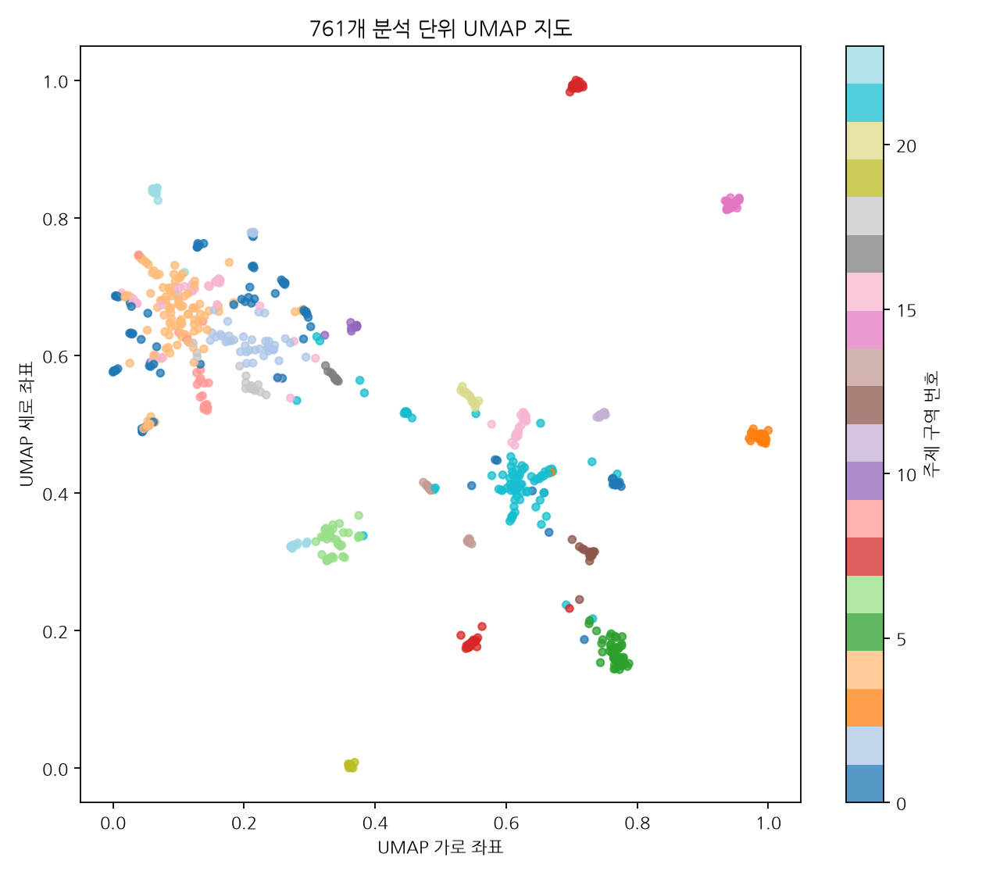
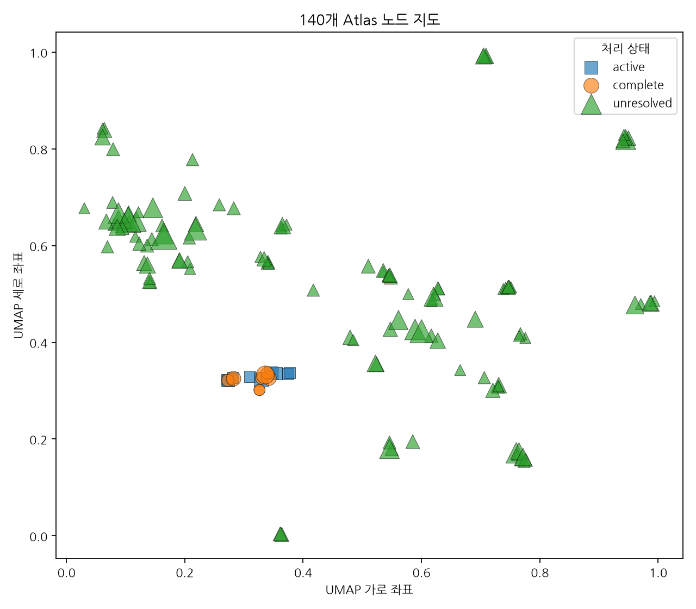
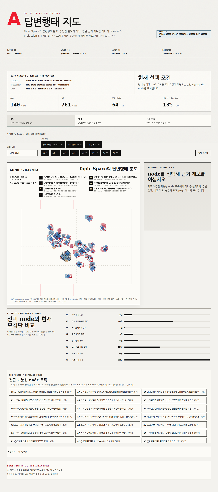
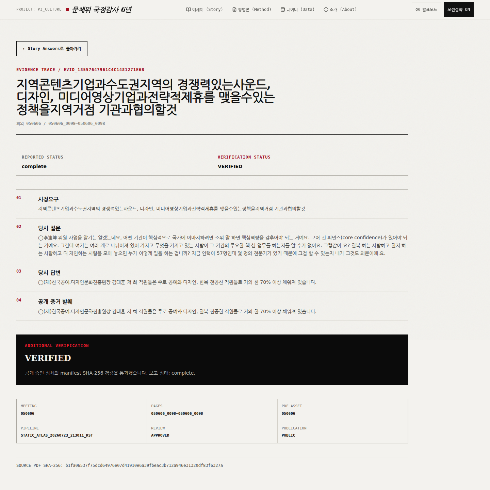

<div align="center">

**Data & ML**

[](https://www.python.org/) [](https://pandas.pydata.org/) [](https://pymupdf.readthedocs.io/) [](https://scikit-learn.org/) [](https://www.sbert.net/) [](https://pytorch.org/) [](https://umap-learn.readthedocs.io/)

**Frontend & Deployment**

[](https://react.dev/) [](https://www.typescriptlang.org/) [](https://vite.dev/) [](https://vercel.com/) [](https://github.com/features/actions)

# 정부감사 답변행태 지도

**처리결과보고서와 국정감사 회의록을 연결해<br>질문·답변·조치의 흐름을 탐색하는 데이터 Atlas**

[소개](#-소개) · [데이터](#-데이터) · [파이프라인](#-전체-파이프라인) · [모델링](#-atlas-모델링) · [결과](#-결과-이미지) · [실행](#-시작하기) · [배포](#-vercel-배포) · [브랜치](#-브랜치-가이드)

</div>

---

## 소개

이 프로젝트는 처리결과보고서와 국정감사 회의록을 연결하여, 감사에서 제기된 문제와 실제 답변·조치가 어떻게 이어지는지 탐색하는 학생 데이터 프로젝트입니다.

회의록 PDF를 발언과 문맥 단위로 정리하고, TF-IDF와 MiniLM을 이용해 관련 후보를 찾았습니다. 자동 검색 결과 중 실제 관련성이 확인된 항목은 검토 완료 데이터로 저장했으며, 이후 지도 생성 단계에서는 이 데이터를 사용했습니다.

검토 완료 761개 분석 단위를 다시 텍스트 벡터로 변환해 24개 주제 구역과 2차원 Atlas를 구성했습니다. 최종 결과는 Story Preview, Full Atlas, Evidence Detail 화면에서 확인할 수 있습니다.

## 주요 결과

| 항목 | 결과 |
|---|---:|
| 회의록 PDF | 42건 |
| 전체 페이지 | 4,495 |
| 텍스트 블록 | 293,717 |
| 화자 발언 | 65,590 |
| 검색 문맥 | 196,686 |
| 질문·답변 묶음 | 25,958 |
| 답변 단위 | 26,063 |
| 검색 query | 297 |
| 검색 후보 | 14,850 |
| 답변행태 label | 769 |
| 최종 분석 단위 | 761 |
| 주제 구역 | 24 |
| Atlas 노드 | 140 |

## Live Demo

**Production:** [https://government-audit-0727.vercel.app](https://government-audit-0727.vercel.app)

| 화면 | 경로 | 설명 |
|---|---|---|
| Story | `/` | 전체 데이터 스토리 |
| 답변행태 Preview | `/#answers` | 핵심 16개 노드 미리보기 |
| Full Atlas | `/atlas` | 전체 140개 노드 탐색 |
| Evidence | `/evidence/:evidenceId` | 관련 원문과 답변 확인 |
| Method | `/method` | 데이터 처리와 모델 역할 |
| Data | `/data` | 데이터 구조와 출처 |

## 주요 기능

| 기능 | 설명 | 데이터 |
|---|---|---:|
| 원본 회의록 처리 | PDF를 페이지·블록·발언으로 구성 | 42 PDF |
| 관련 발언 검색 | TF-IDF 후보 검색 | 297 × 50 |
| 문장 의미 재정렬 | MiniLM cosine rerank | 384D |
| 주제 공간 구성 | 문자 TF-IDF와 SVD | 96D |
| 주제 구역 분류 | KMeans | 24개 |
| 2차원 지도 | UMAP | 761 points |
| Atlas node | 주제·상태·답변유형 집계 | 140 nodes |
| 웹 탐색 | Story·Atlas·Evidence | React |

## 데이터

### 원본 데이터

| 데이터 | 역할 | 형식 | 수량 | 공개 방식 |
|---|---|---|---:|---|
| 처리결과보고서 | 검색할 문제와 조치 문장 | PDF / mapping CSV | 3 | 원본명·SHA-256·파생 query table |
| 국정감사 회의록 | 질문·답변 원문 | PDF | 42 | 공식 URL·페이지 수·SHA-256 |
| 검토 완료 연결 | 관련 발언 연결 | Parquet | 64 | 개인정보를 제외한 공개 export |
| 답변행태 라벨 | A1~A8 답변 방식 | Parquet | 769 | 개인정보를 제외한 공개 export |

### 데이터 카드

- [DATA_SOURCE_CARDS.csv](data/metadata/DATA_SOURCE_CARDS.csv): 원본 45건의 이름·기관·연도·페이지·SHA-256
- [DATA_DICTIONARY.csv](data/metadata/DATA_DICTIONARY.csv): 주요 테이블과 열의 쉬운 설명
- [meeting_sources_public.csv](data/source_registry/meeting_sources_public.csv): 회의록 42건의 공식 URL
- [DATA_NOTICE.md](DATA_NOTICE.md): 원본 데이터와 모델 이용 안내

원본 PDF binary는 일반 Git history에 넣지 않습니다. 공개 재현 패키지는 GitHub Release asset으로 제공하며, 처리결과보고서 PDF 3건은 제외하고 source card와 파생 query로 대체합니다.

## 전체 파이프라인

```text
처리결과보고서
→ 문제·조치 Query

국정감사 회의록 PDF
→ Page → Block → Speaker Turn → Retrieval Segment

Query + Retrieval Segment
→ char/word TF-IDF → MiniLM → RRF → 검토 완료 연결

검토 완료 데이터 761
→ char TF-IDF → SVD 96D → KMeans 24 → UMAP 2D
→ topic × status × answer type → Atlas Node 140
→ frontend manifest → React ViewModel → Vercel
```

## 데이터 추출

PyMuPDF 1.28.0으로 PDF를 페이지 단위로 읽고 `page.get_text("blocks", sort=True)`로 텍스트 블록을 추출했습니다. 화자 표시를 기준으로 연속 발언을 연결하고, 검색할 때 앞뒤 문맥을 함께 볼 수 있도록 `TURN`, `PREV_CURR`, `CURR_NEXT` 세 종류의 검색 문장을 만들었습니다.

```text
42 PDF → 4,495 Page → 293,717 Block
→ 65,590 Speaker Turn → 196,686 Retrieval Segment
```

자세한 설명: [PDF 추출과 발언 연결](docs/methods/pdf-extraction.md)

## 전처리와 정규화

원문 열을 덮어쓰지 않고 정리 열을 별도로 만들었습니다.

1. Unicode NFKC 적용
2. NUL 제거
3. 줄바꿈을 공백으로 변환
4. 다중 공백 정리
5. 앞뒤 공백 제거
6. 문자 검색용 입력에서 공백 제거

숫자·날짜·기관명·구두점은 의미가 바뀔 수 있어 임의 치환하지 않았습니다. 형태소 분석과 stemming은 사용하지 않았습니다.

## TF-IDF·MiniLM 검색

### TF-IDF

| 설정 | 값 |
|---|---|
| 문자 검색 | 3–5 gram, 최대 120,000 특징 |
| 단어 검색 | 1–2 gram, 최대 80,000 특징 |
| query | `L2(issue vector + 0.25 × action vector)` |
| 점수 | `0.65 × char cosine + 0.35 × word cosine` |
| 후보 범위 | 같은 감사 cycle, 상위 50 |

### MiniLM

`sentence-transformers/paraphrase-multilingual-MiniLM-L12-v2`는 TF-IDF 상위 50개 후보의 순서만 다시 정리합니다. query와 후보를 각각 384차원으로 변환하고 masked mean pooling, L2 정규화, cosine similarity를 적용합니다.

### RRF

문자 순위·단어 순위·MiniLM 순위를 `k=60`으로 합칩니다. MiniLM은 Atlas 좌표에 사용하지 않습니다.

자세한 설명: [TF-IDF](docs/methods/tfidf-retrieval.md) · [MiniLM](docs/methods/minilm-rerank.md) · [모델 metadata](models/README.md)

## Atlas 모델링

```text
761 topic anchor
→ char TF-IDF 2–5 gram, 최대 8,192 특징
→ TruncatedSVD 96D, n_iter 15
→ L2 normalization
→ KMeans 24, n_init 40
→ cosine medoid 대표 문장
→ UMAP cosine, neighbors 20, min_dist 0.08
→ topic × status × primary answer type
→ 140 Atlas nodes
```

| 기술 | 역할 |
|---|---|
| TF-IDF | 반복되는 글자 표현을 수치화 |
| SVD | 수천 개 특징을 96개 핵심 패턴으로 압축 |
| KMeans | 비슷한 문장을 24개 주제 구역으로 분류 |
| 대표 문장 | 각 구역을 설명하는 실제 문장 선택 |
| UMAP | 96차원 데이터를 2차원 화면 좌표로 변환 |

> 이 지도는 고차원 텍스트 관계를 2차원으로 옮긴 표시용 공간입니다. 화면상의 거리 자체를 정확한 유사도 점수로 해석하지 않습니다.

## 평가와 검증

| 검증 | 결과 |
|---|---:|
| source card / 회의록 registry | 45 / 42 |
| source hash mismatch | 0 |
| notebook 빈 cell / traceback / 절대경로 | 0 / 0 / 0 |
| 재현 clone UMAP 최대 좌표 차이 | 0.0 |
| projection / node membership 중복 | 0 / 0 |
| frontend manifest 누락 / hash mismatch | 0 / 0 |
| frontend unit test | 67 passed |
| Playwright production preview | 21 passed, 6 skipped, 0 failed |
| Axe critical / serious | 0 / 0 |

정답 집합이 별도로 정의되지 않았으므로 Precision·Recall·F1은 만들거나 추정하지 않습니다.

## 결과 이미지

| UMAP 761 points | Atlas 140 nodes |
|---|---|
|  |  |

| Full Explorer | Evidence Detail |
|---|---|
|  |  |

## 시작하기

### 데이터 노트북

```bash
python3 -m venv .venv
source .venv/bin/activate
python -m pip install -r requirements-data.txt
jupyter nbconvert --to notebook --execute P3_CULTURE_DATA_PIPELINE.ipynb \
  --output P3_CULTURE_DATA_PIPELINE.executed.ipynb \
  --ExecutePreprocessor.timeout=-1
```

전체 실행에는 공식 출처에서 받은 회의록 PDF 42건과 고정 MiniLM snapshot이 필요합니다. GitHub Release의 공개 재현 패키지에는 이 두 항목을 포함합니다.

### Frontend

```bash
cd frontend
npm ci
npm run dev
```

## 빌드와 테스트

```bash
python3 scripts/validate_notebook_portability.py
python3 scripts/validate_data_integrity.py --stage all
python3 scripts/verify_frontend_release.py

cd frontend
npm run typecheck
npm run lint
npm run test
npm run build
npm run test:e2e
npm run test:e2e:preview
```

## 기술 스택

| 영역 | 기술 | 버전 / 역할 |
|---|---|---|
| 데이터 | Python, pandas, NumPy, PyArrow | 3.12.3, 3.0.3, 2.4.6, 24.0.0 |
| PDF | PyMuPDF | 1.28.0 |
| 검색 | scikit-learn, Sentence Transformers | 1.9.0, 5.6.0 |
| 문장 모델 | PyTorch, Transformers | 2.12.1, 5.14.1 |
| 지도 | UMAP-learn, Matplotlib | 0.5.9.post2, 3.11.0 |
| Frontend | React, TypeScript, Vite | 19.2.8, 5.8.3, 6.4.3 |
| 검증 | Vitest, Playwright, Axe | 4.1.10, 1.61.1, 4.12.1 |
| 배포 | GitHub Actions, Vercel | Node 20.20.1 |

## 프로젝트 구조

```text
.
├── P3_CULTURE_DATA_PIPELINE.ipynb
├── data/
│   ├── metadata/
│   ├── source_registry/
│   ├── reviewed/
│   └── pipeline/
├── models/
├── frontend/
│   ├── src/
│   └── public/data/
├── docs/
│   ├── stages/
│   ├── architecture/
│   ├── methods/
│   └── images/
├── reports/
├── scripts/
└── .github/workflows/
```

## Vercel 배포

| 설정 | 값 |
|---|---|
| Project | `government-audit-0727` |
| Production Branch | `main` |
| Root Directory | `frontend` |
| Framework | Vite |
| Install | `npm ci` |
| Build | `npm run build` |
| Output | `dist` |
| Node.js | 20.x |

`VITE_ATLAS_RELEASE_ID`는 production에서 설정하지 않습니다. 앱은 `public/data/current-release.json`의 canonical pointer를 사용합니다. `vercel.json`의 SPA rewrite가 `/atlas`, `/evidence/:evidenceId`, `/method` 직접 접근과 reload를 지원합니다.

## 브랜치 가이드

| Branch | CRISP-DM | 주요 내용 |
|---|---|---|
| `stage/00-project-definition` | Business Understanding | 문제와 범위 |
| `stage/01-data-sources` | Data Understanding | 원본 데이터와 출처 |
| `stage/02-data-preparation` | Data Preparation | PDF·텍스트 전처리 |
| `stage/03-text-mining` | Modeling | TF-IDF·MiniLM 검색 |
| `stage/04-modeling-atlas` | Modeling·Evaluation | SVD·KMeans·UMAP |
| `stage/05-frontend` | Deployment Preparation | React Atlas |
| `stage/06-integration-release` | Deployment | CI·Vercel·release |
| `main` | Integrated Portfolio | 전체 통합 |

각 stage는 이전 checkpoint를 포함하며 PR의 merge commit으로 `main`에 연결됩니다. stage branch는 release 이후에도 유지합니다.

## 문서

| 문서 | 설명 |
|---|---|
| [Stage 00](docs/stages/00-project-definition.md) | 프로젝트 정의 |
| [Stage 01](docs/stages/01-data-sources.md) | 데이터 출처 |
| [Stage 02](docs/stages/02-data-preparation.md) | PDF·텍스트 전처리 |
| [Stage 03](docs/stages/03-text-mining.md) | 텍스트 검색 |
| [Stage 04](docs/stages/04-modeling-atlas.md) | Atlas 모델링 |
| [Stage 05](docs/stages/05-frontend.md) | Frontend |
| [Stage 06](docs/stages/06-integration-release.md) | 통합·배포 |
| [데이터 안내](data/README.md) | 공개 데이터와 원본 준비 |
| [모델 안내](models/README.md) | MiniLM revision과 hash |

## 로드맵

### 완료

- [x] 프로젝트 정의와 원본 데이터 명세
- [x] PDF 추출과 텍스트 전처리
- [x] TF-IDF 검색과 MiniLM 후보 재정렬
- [x] SVD·KMeans·UMAP과 Atlas node
- [x] Story·Full Atlas·Evidence frontend
- [x] stage branch와 merge commit history
- [x] GitHub Actions와 Vercel project 연결

### Release

- [ ] production route QA
- [ ] v1.0.0 GitHub Release와 재현 asset

## 프로젝트 범위

| 영역 | 프로젝트 범위 |
|---|---|
| 데이터 | 공식 감사자료와 회의록 사용 |
| 검색 | TF-IDF 후보와 MiniLM 재정렬 |
| 판단 | 자동 검색 후 검토 완료 데이터 사용 |
| 지도 | 고차원 텍스트 관계를 2차원으로 표시 |
| 거리 해석 | 2차원 거리는 참고용 |
| frontend | Story·Atlas·Evidence |
| 배포 | 정적 SPA와 canonical data bundle |

## 라이선스

분석 코드와 문서는 [MIT License](LICENSE)를 따릅니다. 원본 데이터와 외부 모델은 각각의 발행기관 및 원 모델 이용 조건을 확인해야 합니다.

---

<div align="center">

**정부감사 답변행태 지도** — 정부감사 자료를 질문·답변·조치의 흐름으로 탐색하는 데이터 Atlas

</div>
